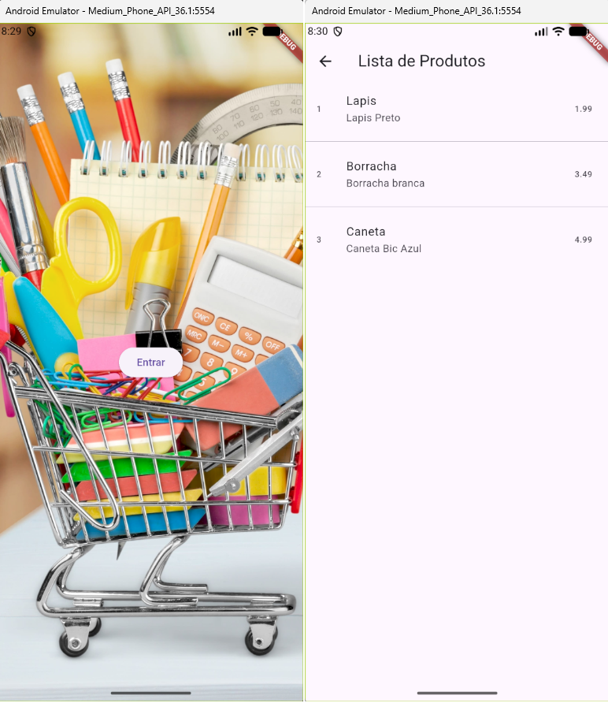

# Flutter_lista_produtos_2026
Aplicativo de estudos de listas com flutter
- List
- ListView
- Conceitos de MVC com classe Modelo
- Conceitos de Mockup
## Tecnologias
- Flutter
## Print

## Tutorial para um novo projeto com lista
#### 1 Iniciar um novo projeto
- CTRL + Shift + P, Flutter: new Project, Empty ..., escoha a pasta, e coloque o nome de **produtos**.
- Crie uma pasta /assets e coloque a imagem que será utilizada no fundo
- Altere o arquivo **pubspec.yaml**
```yaml
flutter:
  uses-material-design: true
  assets:
    - assets/
```
#### 2 Crie a estrutura de pastas a seguir
```
lib
    main.dart
    ui
        home.dart
        produtos.dart
    models
        produto.dart
```
#### 3 Preencha os arquivos com os códigos deste repositório
Alterando os nomes das imagens para as que você escolheu.
- Este projeto possui exemplos de navegação de telas com Navigator.push(), Navigator.pop().
- Exemplo tamblem de ListView.

## Passo a passo para testar este códico
- 1 Clone este repositório.
- 2 Abra com VsCode, instale as dependências e execute o lib/main.dart
```bash
flutter pub get
flutter run
```